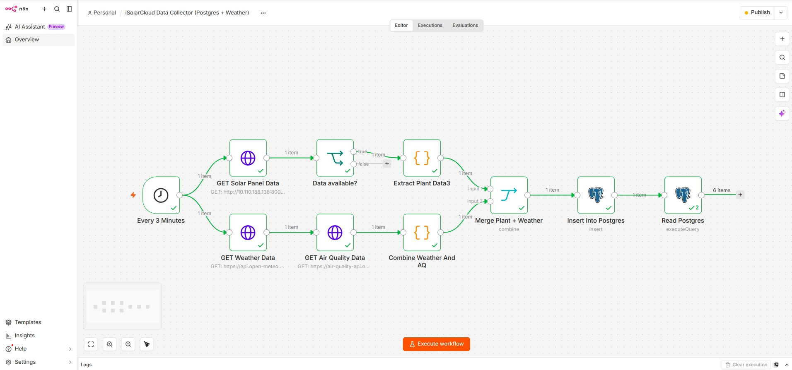
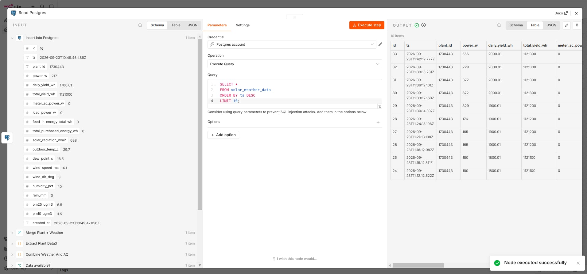

# iSolarCloud Data Collector

An automated n8n workflow that collects comprehensive solar panel performance data alongside environmental conditions (weather and air quality), then stores everything in a PostgreSQL database for analysis and monitoring.

## Overview

This workflow provides real-time monitoring of solar panel installations by combining operational data with environmental factors that affect performance. Running every 3 minutes, it creates a complete picture of solar energy production and the conditions influencing it.

## Features

- **Automated Collection**: Runs every 3 minutes without manual intervention
- **Multi-Source Data**: Combines solar, weather, and air quality data in a single record
- **Data Validation**: Checks authentication before processing solar data
- **Timezone Handling**: Converts timestamps from Africa/Tunis to UTC for consistent storage
- **Real-time Verification**: Reads back the 10 most recent records after each insert

## Workflow Steps

1. **Trigger**: Scheduled every 3 minutes
2. **Parallel Data Fetch**:
   - Solar panel data from local iSolarCloud API
   - Weather data from Open-Meteo API
   - Air quality data from Open-Meteo Air Quality API
3. **Data Processing**:
   - Validates solar data authentication
   - Extracts plant data for multiple solar installations
   - Combines weather and air quality metrics
   - Merges all data sources
4. **Storage**: Inserts combined data into PostgreSQL

*Sample data stored in PostgreSQL showing the combined solar, weather, and air quality metrics*

## Data Schema

### Solar Panel Metrics
- `power_w` - Current power output (Watts)
- `daily_yield_wh` - Energy produced today (Watt-hours)
- `total_yield_wh` - Total lifetime energy production (Watt-hours)
- `meter_ac_power_w` - AC meter reading (Watts)
- `load_power_w` - Current load consumption (Watts)
- `feed_in_energy_total_wh` - Total energy fed to grid (Watt-hours)
- `total_purchased_energy_wh` - Total energy purchased from grid (Watt-hours)

### Weather Conditions
- `solar_radiation_wm2` - Solar irradiance (W/m²)
- `outdoor_temp_c` - Air temperature (°C)
- `dew_point_c` - Dew point temperature (°C)
- `wind_speed_ms` - Wind speed (m/s)
- `wind_dir_deg` - Wind direction (degrees)
- `humidity_pct` - Relative humidity (%)
- `rain_mm` - Precipitation (mm)

### Air Quality
- `pm25_ugm3` - Fine particulate matter concentration (μg/m³)
- `pm10_ugm3` - Coarse particulate matter concentration (μg/m³)

### Metadata
- `ts` - Timestamp in UTC
- `plant_id` - Unique identifier for each solar installation
- `created_at` - Database insertion timestamp

## API Endpoints Used

- **Solar Data**: Local iSolarCloud API (`http://localhost:8000/api/realtime`)
- **Weather**: Open-Meteo Forecast API (`https://api.open-meteo.com/v1/forecast`)
- **Air Quality**: Open-Meteo Air Quality API (`https://air-quality-api.open-meteo.com/v1/air-quality`)

## Use Cases

- Real-time solar panel performance monitoring
- Correlation analysis between weather conditions and energy production
- Air quality impact assessment on solar efficiency
- Historical data analysis and reporting
- Predictive maintenance based on performance patterns
- Energy production forecasting

## License

This workflow configuration is provided as-is for monitoring solar panel installations.